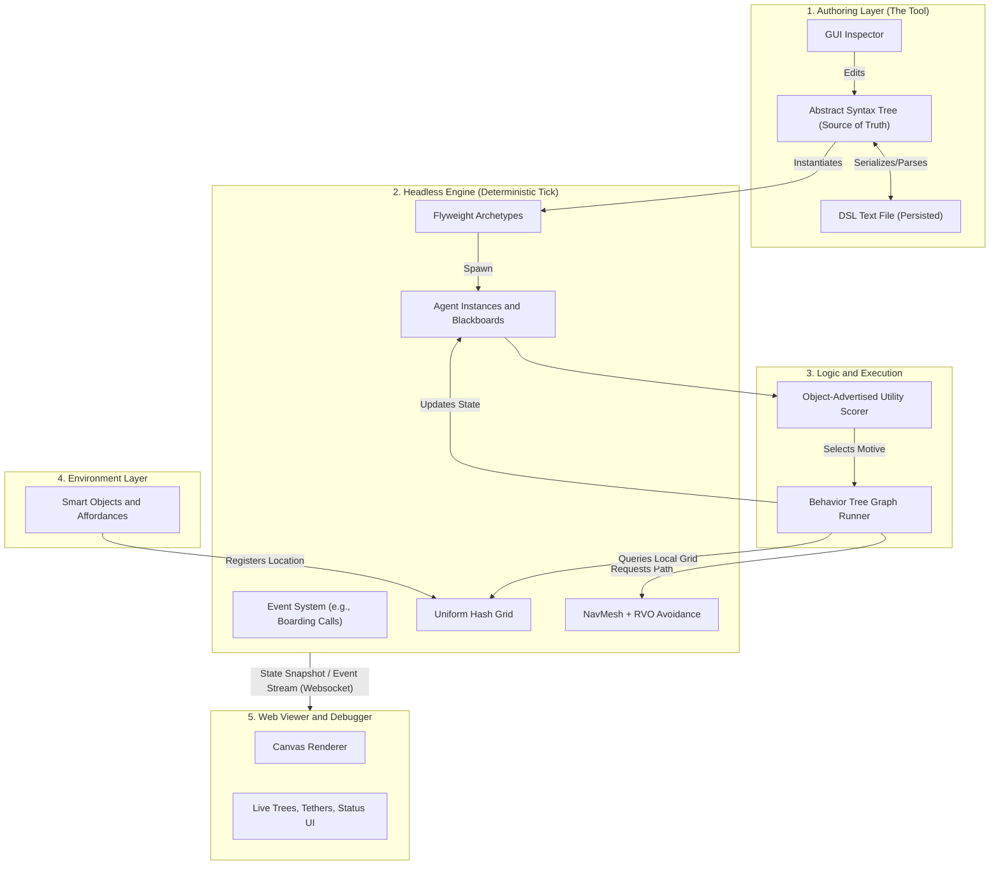
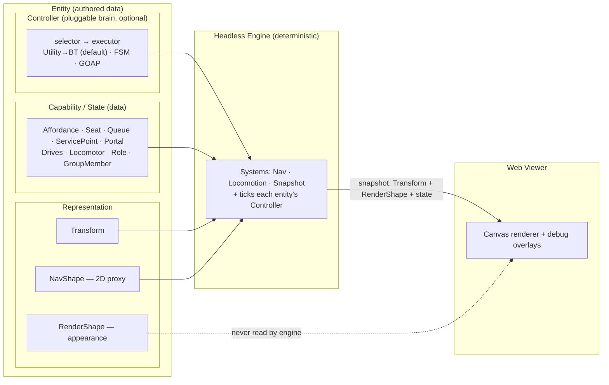

# Multi-Character Simulation Authoring Tool: Architecture Document

## Overview
This document outlines the architectural blueprint for an MVP authoring tool and engine designed to simulate multi-character, systemic environments (e.g., airports, coffee shops).

The system prioritizes a **GUI-backed Domain Specific Language (DSL)** for authoring, a **headless deterministic Python engine**, and a **Hybrid AI** decision-making model based on object-advertised utility.

---

## 1. Architectural Flow Pipeline

---

## 2. Integration & Runtime Semantics (The Load-Bearing Decisions)

To prevent severe integration failures (oscillation, deadlocks, and spaghetti state), the engine strictly adheres to the following runtime contracts.

### A. The Tick Model, Determinism, & Streaming
*   **Decoupled Simulation:** The engine is completely headless. It runs on a fixed-timestep tick (e.g., 10 ticks per second) fully decoupled from the render frame rate.
*   **Determinism & RVO Caveat:** The simulation uses a seeded RNG to guarantee deterministic replay on the same build/machine ("the agent broke at tick 4200" -> perfectly reproducible). Note that float-based RVO/ORCA math is generally not cross-platform deterministic (due to compiler optimizations and floating-point registers); for a single-machine debugging tool, this level of same-machine reproducibility is sufficient.
*   **Decoupled Snapshot Streaming:** The engine emits state snapshots over a WebSocket. To conserve bandwidth, the snapshot emitter decouples the network snapshot rate from the inner simulation tick rate (e.g., sending updates at 5Hz or only when significant changes occur), utilizing delta/keyframe encoding. The web client interpolates agent coordinates smoothly between snapshots.

### B. Utility <-> BT Interruption Contract
When Utility evaluates a new motive, it must resolve conflicts with the currently executing Behavior Tree to prevent **Dithering/Oscillation** (flipping between tasks every frame) or **Unresponsiveness** (ignoring a flight to finish coffee).
*   **Motive-Level Hysteresis:** The inertia bonus protects the *motive level* (e.g., satisfying the "Caffeine" need), not the specific object level (e.g., a specific espresso machine). This allows the agent to freely re-evaluate and switch to a different target object satisfying the same motive (for example, if their reserved machine breaks or times out) without paying the hysteresis switching cost. A newly evaluated *different motive* must beat the current active motive's score by a strict margin (e.g., 1.2x) to trigger an interruption.
*   **Interrupt Semantics & Clean-up:** Nodes are tagged as *Interruptible* (walking) or *Atomic* (mid-sip of coffee). If an interrupt is forced, the BT executes a required `OnAbort` clean-up path to safely release locks, drop items, and clear blackboard scratch space before switching motives.

### C. Smart Object Reservation Lifecycle
Multiple agents querying the world for "an empty chair" will cause a race condition if they don't lock their targets.
*   **The Lifecycle:** Reserve -> Travel -> Occupy -> Release.
*   **Concurrency Rules:** An agent must claim a reservation slot on a Smart Object *before* pathfinding to it. If the agent fails to arrive within a timeout window, or their BT aborts the task, the reservation is released.

### D. Navigation & Locomotion (The 4th Pillar)
Agent movement is not a trivial leaf node; it requires a dedicated spatial subsystem to prevent crowds from clipping or piling up.
*   **Global Pathfinding:** A pre-baked NavMesh or Grid A* is used to find the macro-path around walls and through portals.
*   **Local Avoidance:** An RVO (Reciprocal Velocity Obstacles) or ORCA steering model acts as the micro-layer, dynamically adjusting velocities to avoid other agents in dense crowds (like queues).

### E. AI LOD (Cognition vs. Locomotion Split)
In an OOP engine, the performance wall is the per-agent tick cost. To scale to ~1000 agents, the Level of Detail (LOD) system must decouple cognition from locomotion:
*   **Cognitive LOD (Staggered Thinking):** We do not evaluate Utility or re-plan Behavior Trees for every agent on every tick. Re-planning is staggered on a think-budget (e.g., once every 500ms for active agents). For distant or off-screen agents, cognitive planning can be throttled even harder (e.g., every 2-5 seconds).
*   **Locomotion LOD (Avoidance):** RVO/ORCA steering must run near-every-tick for visible agents to prevent jittering and clipping. However, off-screen or distant agents can drop to a cheap straight-line locomotion model that bypasses local avoidance entirely, saving critical CPU cycles without degrading visual quality.

---

## 3. Core AI Technologies

### A. Object-Advertised Utility (The "What to do")
*   **Description:** Rather than agents calculating complex internal logic to find objects, **Smart Objects advertise their utility.** An espresso machine advertises `+40 Caffeine`. The agent simply evaluates its internal drives against all advertised affordances in the vicinity and picks the highest-scoring match.
*   **Role in Architecture:** This collapses "what to do" and "with what object" into a single, highly scalable, purely data-driven mechanism.

### B. Behavior Trees (The "How to do it")
*   **Description:** A hierarchical node graph (Selectors, Sequences) that executes procedural steps systematically.
*   **Role in Architecture:** Once an object is selected, the BT executes the rigid steps: `[Reserve Object -> Navigate (NavMesh+RVO) -> Occupy -> Play Anim -> Release]`. BTs utilize a **Per-Agent Blackboard** to store scratch state (e.g., "The ID of the chair I reserved").

### C. Two-Tier Object Lookup: Global Registry & Local Hash Grid
*   **Description:** The world state uses a two-tier spatial query mechanism to resolve distant fixtures versus local contention:
    1.  **Global Registry:** Keyed by affordance type (e.g., "Airport Gate", "Coffee Counter"). Fixed, public, macro-level fixtures are registered here. This supports "omniscient queries" (e.g., an agent far away knows how to pathfind to their boarding gate without searching every room).
    2.  **Uniform Hash Grid:** A spatially partitioned grid used for local queries. This offers excellent cache behavior and avoids the rebalancing overhead of a Quadtree.
*   **Role in Architecture:** Agents use the Global Registry for macro-destination selection, but query the local **Uniform Hash Grid** to resolve micro-contention and proximity (e.g., finding the nearest free chair once inside the coffee shop, or calculating crowd density for local steering avoidance).

### D. Event System
*   **Description:** A global event bus handles asynchronous state changes (e.g., "Boarding Call for Gate 5", "Machine Broke").
*   **Role in Architecture:** Agents listen for relevant events rather than polling the world state every tick. A boarding call event instantly modifies the agent's Utility multipliers.

### E. DSL & The AST Source of Truth
*   **Description:** The authoring tool generates an Abstract Syntax Tree (AST) representing the AI logic.
*   **Role in Architecture:** The **AST is the single source of truth**, persisted as a text-based Domain Specific Language (DSL). The GUI editor edits the AST, which is then serialized to text. Hand-edits by power users are parsed back into the AST. The GUI never blindly manipulates text strings, ensuring flawless round-tripping.

---

## 4. Visual Debugging Requirements
The Web Client renders debug overlays directly from the engine's serialized state stream.
1.  **Live Tree Highlighting:** A UI panel showing the active BT node flashing green, and failed/aborted nodes flashing red.
2.  **Interaction Tethers:** Visible lines linking agents to their currently reserved or occupied Smart Objects.
3.  **Overhead Status UI:** Hovering over an agent reveals their internal drives (Fatigue, Bladder) and active Utility scores.
4.  **Queue Slot Visualization:** Renders bounding boxes for Smart Queue slots (White = Empty, Blue = Reserved/Occupied).

---

## 5. Open Items (to resolve during the build, not on paper)
*   **Agent population lifecycle:** spawn/despawn scheduling (arrival schedules, spawn rates) must be driven by the seeded RNG/schedule, never wall-clock, to preserve deterministic replay.
*   **Need-decay model:** growth/decay curves per drive (Caffeine, Fatigue, Bladder). Content/tuning; deferred.
*   **Utility response curves, BT node taxonomy, DSL grammar, snapshot serialization format:** implementation details, resolved in code.

---

## 6. Entity-Component Model (the authoring & runtime substrate)

> **Status: implemented (Phase 1 complete).** `Agent` and `SmartObject` are now
> entities composed from the components below — Representation (`Transform`/
> `NavShape`/`RenderShape`), Capability/State (`Drives`, `Locomotor`,
> `Blackboard`; world-side `Affordance`, `SlotSet`), and a pluggable `Controller`
> (`Utility→BT`). The refactor was done at **parity** (zero new features; the
> determinism test still proves bit-identical replay), and components are now
> independently testable ([tests/test_components.py](../tests/test_components.py)).
> Still deferred to later phases: walls as `NavShape(static)` entities and
> systems querying entities by component type (scene-as-data), then GUI authoring.

### A. The Entity
Following the Unity/Unreal/Godot convention, everything in the world — props,
fixtures, walls, agents — is one kind of thing:

> **Entity** = `Transform` + `RenderShape` + `NavShape` + `[components]`

| Part | Role | 2D now → 3D later |
|---|---|---|
| **Transform** | pose: position + facing | `(x, y, θ)` now; gains `z`/rotation later |
| **RenderShape** | appearance, **for the viewer only** (≈ MeshRenderer) | 2D footprint/sprite now; 3D mesh later |
| **NavShape** | simplified collision/nav proxy the **engine** consumes (≈ collider) | stays 2D (nav on the floor plane) |
| **Components** | what the entity *has* and what *drives* it — in three tiers (§D) | unchanged by 3D |

This is **lightweight composition, not a data-oriented ECS**: an entity holds a
list of components; engine *systems* query for the component types they need.
At our scale (tens–hundreds of agents, Python) that gives the modularity
without the ceremony.

### B. The headless boundary (invariant)
*   **The engine reads `Transform` + `NavShape` + components. It never reads
    `RenderShape`.** RenderShape is pass-through metadata streamed to the viewer.
*   This preserves the headline invariants (§2A): the engine stays deterministic
    and rendering-free; the viewer remains a pure function of the snapshot
    stream. "Place geometry" in the GUI means *set Transform + NavShape (+ optional
    RenderShape)*; "assign behaviour" means *attach components* — cleanly separable.

### C. 2D-now / 3D-later is cheap
Because the visual mesh and the AI proxy are separate, the 3D upgrade is
localized: **only `Transform` and `RenderShape` change**. `NavShape` stays 2D,
so the entire AI stack — Utility, BT, A*, ORCA, queues, groups — is untouched.
3D is a *renderer + transform* concern, not an AI rearchitecture.

### D. Components come in three tiers
A flat component list conflates two different things: *what an entity offers and
knows* (data) versus *what drives it* (the brain). Keep them in separate tiers.

| Tier | Examples | Read by |
|---|---|---|
| **Representation** | `Transform`, `NavShape`, `RenderShape` | systems (+ viewer) |
| **Capability / State** (data) | world: `Affordance`, `Seat`/`SlotSet`, `Queue`, `ServicePoint`, `Portal` · agent: `Drives`, `Locomotor`, `Role`, `GroupMember`, `Inventory`, `Blackboard` | systems **and** the controller |
| **Controller** (the brain — optional, pluggable) | `Utility→BT` (default), `FSM`, `GOAP`, custom | drives the entity |

A **SmartObject is not a component** — it is any entity that holds `Affordance`
(+ `Seat`/`Queue`/`ServicePoint`). It is the *world* side of an interaction,
distinct from the *decision* (Controller) side; the two must not be lumped
together. Examples:
*   **chair** = Representation + `Affordance`+`Seat` — *no controller* (passive)
*   **espresso machine** = Representation + `Affordance`+`ServicePoint` + an `FSM` controller (`idle→brewing→ready`)
*   **guest** = Representation + `Drives`+`Locomotor`+`Role` + a `Utility→BT` controller

(`NavShape` carries a `static` flag: static entities — walls, furniture — bake
into the grid; dynamic entities — agents — feed ORCA as a radius. One convex
footprint serves grid-rasterization, agent radius, and query bounds — no
separate physics collider yet.)

### E. The Controller (the pluggable brain)
FSM, Behavior Tree, Utility, and GOAP are decision *architectures* — **not flat
peers**. They compose as **selector → executor**:
*   **selector** ("what to do"): Utility (or an FSM)
*   **executor** ("how to do it"): a Behavior Tree, GOAP planner, or FSM

The engine's default brain is **Utility(select) → BT(execute)**, glued by the
§2B interruption/hysteresis contract. The selector and executor live inside
**one `Controller` component** so that contract stays well-defined — exposing
`Utility` and `BehaviorTree` as two independent sibling components would make
"who interrupts whom" ambiguous. Swapping the brain (e.g. GOAP in place of BT,
or a trivial scripted controller for testing locomotion) is a one-component
change that touches neither the world nor other agents. A controller attaches to
**any entity with autonomous behaviour** — rich brains on agents, simple FSMs on
active objects, none on passive props. (Today's `utility.py` + `behavior_tree.py`
+ the glue in `agent.py` *are* exactly this hardwired Utility→BT controller;
Phase 1 extracts it into a `Controller` component.)

### F. Systems (engine, query by component type)
| System | Reads |
|---|---|
| Nav build | `NavShape(static)` → inflated grid |
| Locomotion | `Transform` + `NavShape(radius)` + `Locomotor` |
| Controller tick | `Drives` + nearby `Affordance` (select) → `Seat`/`Queue`/`ServicePoint` (execute) |
| Snapshot emitter | `Transform` + `RenderShape` + component state → viewer |

### G. Scene-as-data vs. config
Entities-with-components serialize to a **scene file** — this *is* the DSL/AST
(§3E), and the GUI edits it. This stays distinct from [config.yaml](../config.yaml),
which holds subsystem *tuning* only (§ "Config vs scene boundary" in CLAUDE.md).
The phased path: **Phase 1** parity refactor → **Phase 2** add features as
components, each behind its own micro-scene + test → **Phase 3** scene-as-data →
**Phase 4** GUI authoring + live control.

